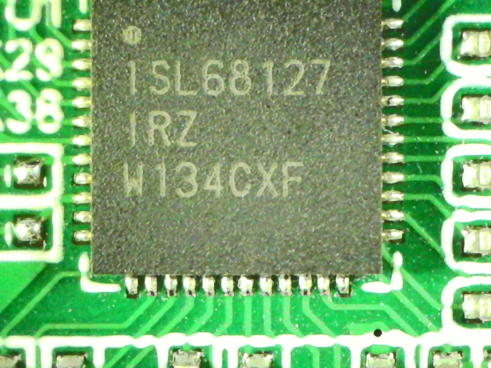
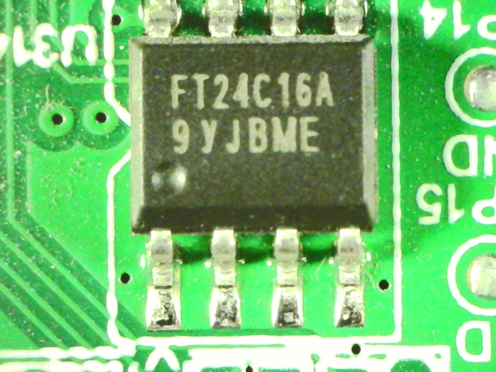
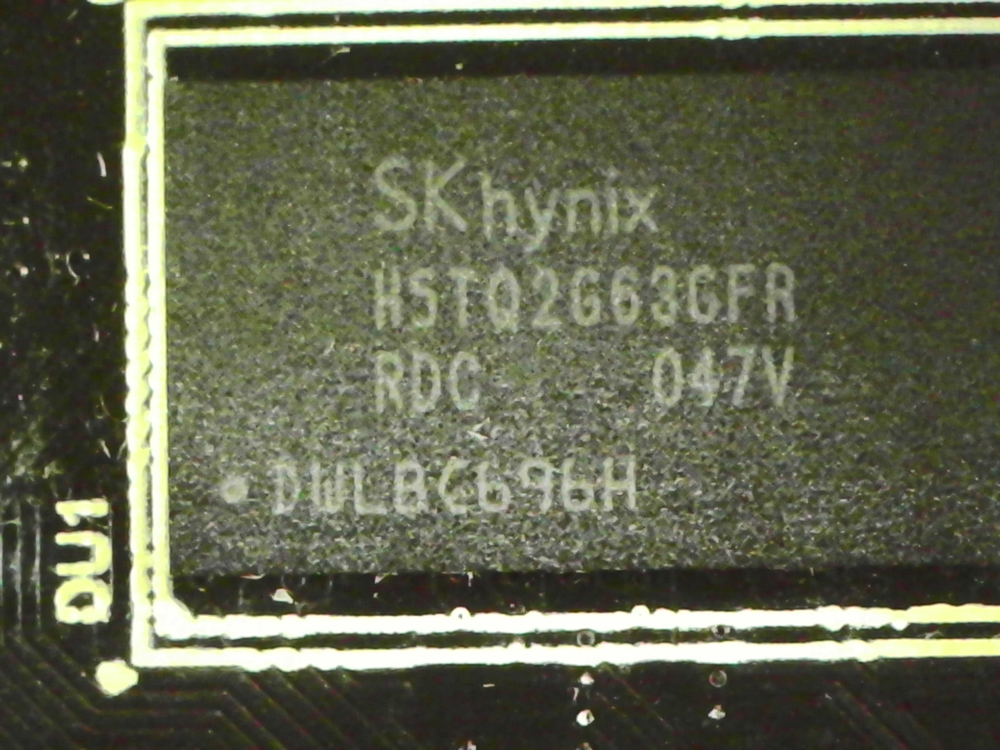

# Hash Board

This page summarizes the green hash board and ASIC-adjacent observations.

## Confirmed

- The mining subsystem communicates with the host over framed UART traffic.
- The board exposes status, result, and work-response behavior consistent with a dedicated mining-side MCU and ASIC workflow.
- At least one observed regulator on the mining side is an **ISL68127**.
- A small device on the hash board is marked `FT24C16A`.
- A small local flash device on the hash board is marked `MX25U4033E`.

## Inferred

- The mining-side design supports more than one regulator implementation under a common firmware layout.
- The firmware appears to support multiple rail-controller families, including paths labeled like `ISL` and `IS6608A`.

## Unknown

- Exact ASIC device identity
- Exact number of mining dies or internal lane structure
- Whether all apparent connector positions are used in every hardware variant
- Exact stock role of the `FT24C16A` EEPROM and `MX25U4033E` flash
- Identity of still-unread support ICs on the green board

## Regulator-variant evidence

The MCU firmware contains separate PMBus-like configuration/readback paths for:

| Device address | Observed role |
| --- | --- |
| `0xc0` | ISL Vddr path |
| `0xb4` | ISL Vcore or second ISL rail path |
| `0x62` | IS6608A-style Vddr path |
| `0x60` | IS6608A-style Vcore path |

This strongly suggests a shared firmware base that can operate across more than one regulator population.

## Additional identified devices

| Marking | Likely identity | Likely role |
| --- | --- | --- |
| `ISL68127 IRZ` | Renesas / Intersil ISL68127 | digital PMBus PWM controller |
| `FT24C16A` | serial I2C EEPROM | board-local configuration or calibration storage |
| `MX25U4033E` | 1.8 V SPI NOR flash | local non-volatile storage |

## Evidence

- Board photography identified `ISL68127` on the mining-side board.
- Microscope photos identified `FT24C16A` and `MX25U4033E` package markings directly on the green board.
- MCU firmware decompilation shows separate register-write and readback logic for multiple PMBus device addresses.

## Photos

