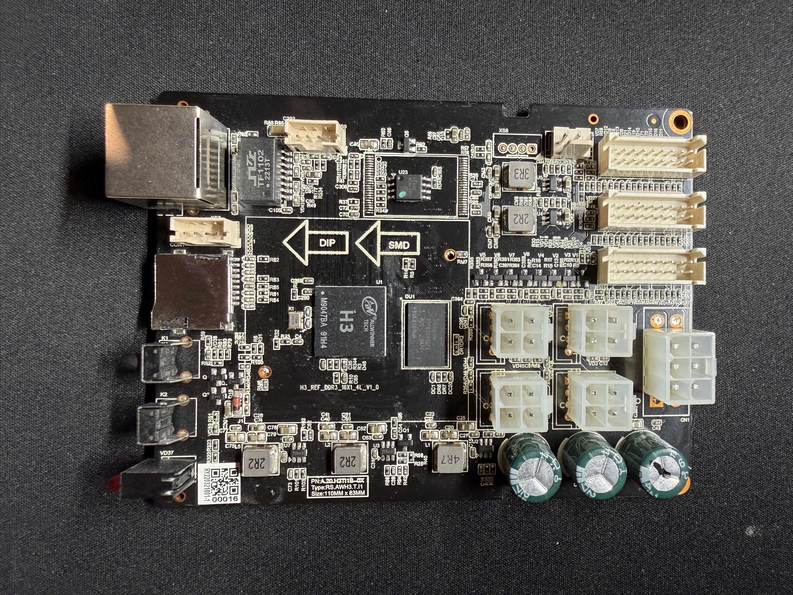
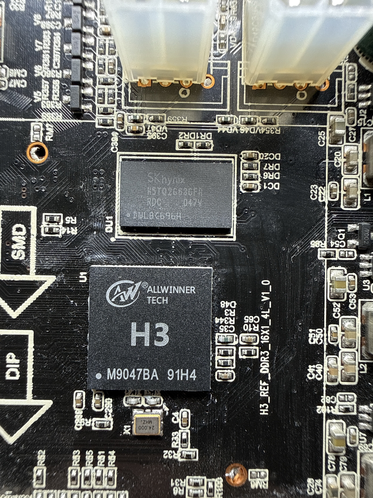

# Host Board

This page covers the Linux-capable controller board only.

## Confirmed

- SoC: **Allwinner H3**
- Board silkscreen: `H3_REF_DDR3_16X1_4L_V1.0`
- Board type marking: `Type: RS.AWH3.T1`
- Board size marking: `110MM X 83MM`
- Ethernet magnetics module: `HanRun TF102 2213T`
- External flash: `EN25QH128A-104HIP`, 16 MB SPI NOR
- DRAM: single external SK hynix DDR3 device, likely `H5TQ2G63GFR` family

## Inferred

- DRAM capacity is likely **256 MB** from the visible x16 DDR3 package and part-family pattern.
- The controller board appears to be based on a reusable Allwinner H3 reference-style layout adapted for this miner family.

## Unknown

- Exact DRAM suffix and speed grade
- Whether the unpopulated controller-side footprints are used in other product variants

## Observed layout

- Left side: Ethernet, card slot, barrel-style power/IO connectors
- Center: H3 SoC, DDR3 package, oscillator, support passives
- Right side: board-to-board headers and distributed power area
- Lower-right: larger DC-DC components and bulk capacitance

## Evidence

- The host SoC package is visibly marked `ALLWINNER TECH H3`.
- The board silkscreen clearly shows `H3_REF_DDR3_16X1_4L_V1.0`.
- A closeup photo identifies the DRAM package as an SK hynix DDR3 device in the `H5TQ2G63...` family.

## Photos

